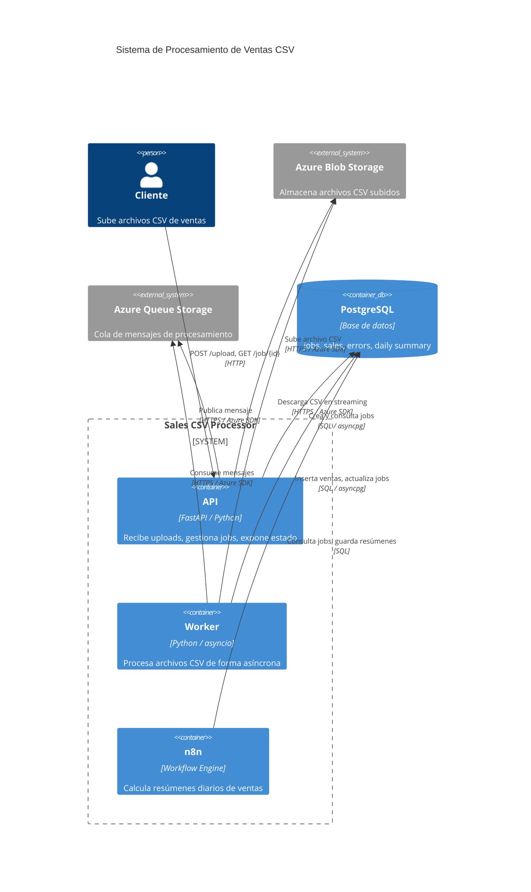
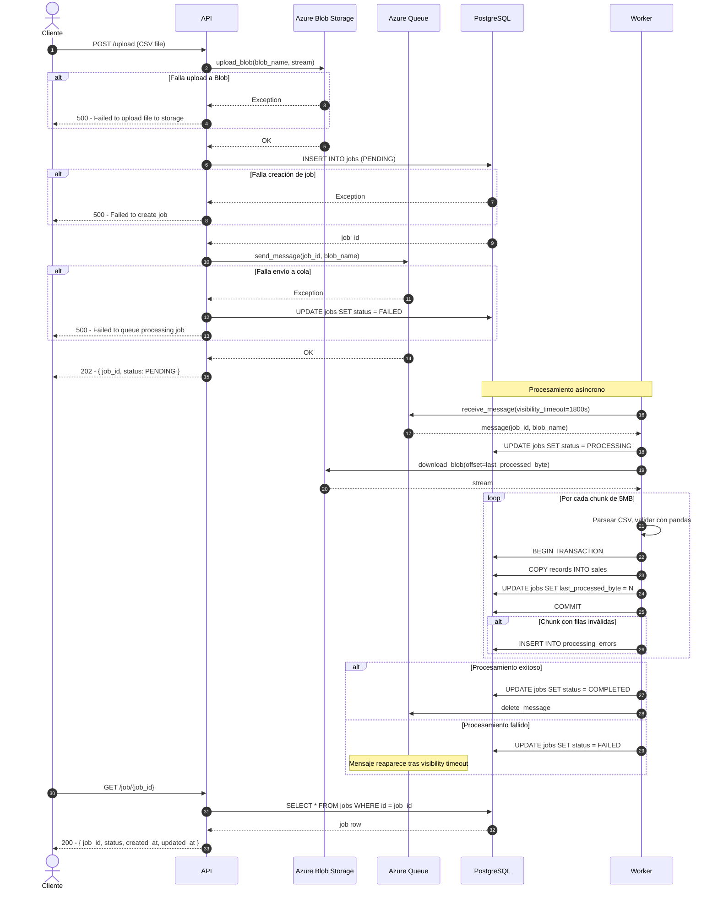
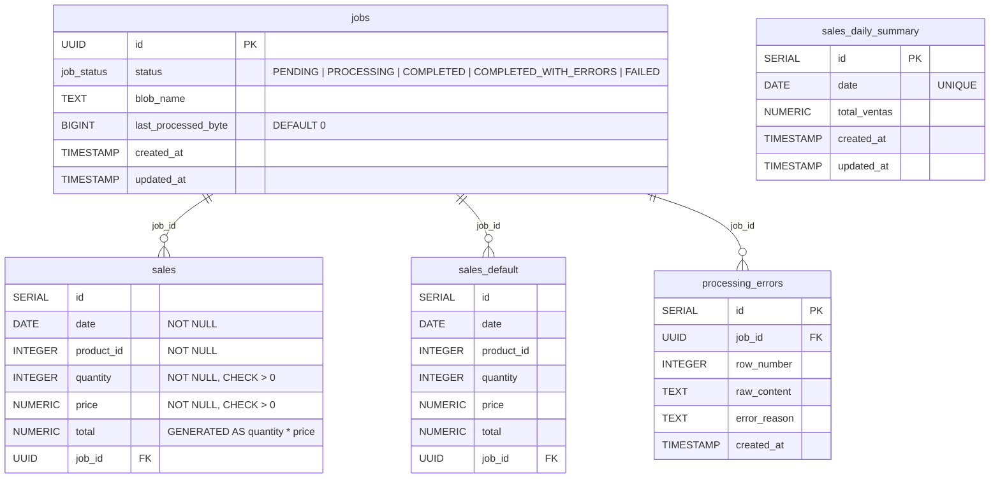

# Sistema de Procesamiento de Ventas CSV

## Cómo levantar el sistema y probarlo 

Las instrucciones detalladas para la configuración, levantamiento y pruebas del sistema están [aquí](https://github.com/thefooliest/logyca_test/blob/main/RUNNING.md) 

## Arquitectura General

Arquitectura orientada a eventos con procesamiento asíncrono basado en colas. Se eligió sobre procesamiento síncrono porque el volumen de datos hace inviable procesar en el mismo request HTTP. Se eligió sobre microservicios completos porque el alcance del sistema no justifica la complejidad operacional.

```
Cliente → API → Azure Blob Storage
                Azure Queue → Worker → PostgreSQL
n8n → PostgreSQL → sales_daily_summary
```

---

## API — FastAPI

- El endpoint `POST /upload` no procesa datos, solo orquesta: sube a Blob, encola, responde con `job_id`
- El archivo se sube a Azure Blob Storage en chunks via streaming para nunca cargar el CSV completo en memoria del servidor
- El estado del job vive en PostgreSQL, no en Redis, porque el volumen de polling no justifica agregar una dependencia extra

---

## Cola — Azure Queue

- Se usa Azure Storage Queue como intermediario entre API y worker
- El visibility timeout se calibra contra el peor caso conocido de procesamiento como primera línea de defensa contra reprocesamiento
- El worker borra el mensaje explícitamente solo después de completar exitosamente

---

## Worker — Proceso Separado

- Corre como contenedor Docker independiente, separado de la API
- Se eligió sobre **Celery** porque Azure Queue ya provee el broker — Celery sería redundante
- Se eligió sobre **Azure Functions** porque el procesamiento prolongado de archivos pesados no encaja bien con serverless
- Se eligió sobre **hilo dentro de la API** porque mezclaría responsabilidades e impediría escalar independientemente
- Escala horizontalmente levantando más réplicas del contenedor

---

## Procesamiento del CSV

- Se usa pandas con `chunksize` para procesar el archivo en bloques sin cargarlo completo en memoria
- El tamaño de chunk inicial es 10.000 filas, ajustable según pruebas de carga
- La validación ocurre en Python antes del insert, usando operaciones vectorizadas de pandas
- Las filas inválidas se guardan en `processing_errors` con `job_id`, número de fila, contenido crudo y razón del error
- Los jobs pueden terminar como `COMPLETED_WITH_ERRORS` para distinguir éxito total de éxito parcial

---

## Idempotencia y Checkpointing

- El worker guarda `last_processed_byte` en la tabla de jobs después de cada chunk
- La inserción del chunk y la actualización del checkpoint ocurren en la **misma transacción atómica**
- Si el worker muere y el mensaje reaparece en la cola, el nuevo worker retoma desde el último checkpoint sin duplicar datos

---

## Base de Datos — PostgreSQL

### Particionamiento

- La tabla `sales` está particionada por fecha para aislar inserts del día actual de datos históricos
- La partición del día activo **no tiene índices** para maximizar velocidad de escritura
- Las particiones históricas tienen índice en `date` para optimizar consultas
- Se crean particiones futuras anticipadamente en el job nocturno
- Existe una partición `DEFAULT` como red de seguridad para fechas no cubiertas

```sql
CREATE TABLE sales (...) PARTITION BY RANGE (date);

CREATE TABLE sales_2026_05_07 PARTITION OF sales
    FOR VALUES FROM ('2026-05-07') TO ('2026-05-08');

CREATE TABLE sales_default PARTITION OF sales DEFAULT;
```

### Columna Generada

- `total` es una columna generada `GENERATED ALWAYS AS (quantity * price) STORED`
- El cálculo vive en la base de datos, no en el worker, eliminando riesgo de inconsistencia

### Validación en Base de Datos

- Los constraints `NOT NULL` y `CHECK` actúan como segunda línea de validación tras la validación en Python

```sql
quantity INTEGER NOT NULL CHECK (quantity > 0),
price    NUMERIC NOT NULL CHECK (price > 0),
date     DATE NOT NULL
```

### Inserción Masiva

- Se usa `COPY FROM` vía `asyncpg` para inserción masiva en lugar de `INSERT INTO` por fila
- Se usa connection pooling con `asyncpg` para no agotar conexiones disponibles

### Cómo se Evita Saturar PostgreSQL

Se evita mediante tres mecanismos combinados:

1. **Connection pooling** — limita el número de conexiones simultáneas
2. **Inserción por batches con `COPY FROM`** — reduce overhead de I/O frente a inserts individuales
3. **Particionamiento** — mantiene los índices de escritura activa sin índices durante el día

---

## n8n

- El workflow corre en un cron nocturno
- La agregación de ventas por día se hace con una query SQL directa en el nodo de PostgreSQL de n8n, sin pasar por un endpoint de la API, porque es lógica suficientemente simple que no justifica superficie adicional en el backend
- El job nocturno además crea la partición del día siguiente y opcionalmente indexa la partición del día que cierra

```sql
SELECT date, SUM(total) AS total_ventas
FROM sales
WHERE job_id IN (SELECT id FROM jobs WHERE status = 'COMPLETED')
GROUP BY date;
```

---

## Infraestructura Local

- Docker Compose orquesta API, worker, PostgreSQL y Azurite
- **Azurite** emula Azure Blob Storage y Azure Queue localmente sin necesitar cuenta de Azure
- API y worker comparten el mismo Dockerfile pero tienen comandos de arranque distintos
- Solo la API expone puerto — el worker no recibe tráfico externo


## Estructura del Proyecto

```
project/
├── api/
│   ├── main.py
│   └── routes/
│       ├── upload.py
│       └── jobs.py
├── worker/
│   ├── consumer.py        # escucha la cola
│   └── processor.py       # lógica de chunks y checkpointing
├── services/
│   ├── blob.py            # Azure Blob Storage
│   └── queue.py           # Azure Queue
├── repository/
│   ├── jobs.py            # CRUD de jobs
│   └── sales.py           # inserts de sales y errores
├── models/
│   └── schemas.py         # Pydantic models
├── db/
│   └── migrations/        # DDL de tablas y particiones
├── tests/
└── docker-compose.yml
```

---

# Diagramas de Arquitectura

## Diagrama 1 — Arquitectura General (C4 Contenedores)



---

## Diagrama 2 — Flujo de Secuencia del Upload



---

## Diagrama 3 — Modelo de Datos


